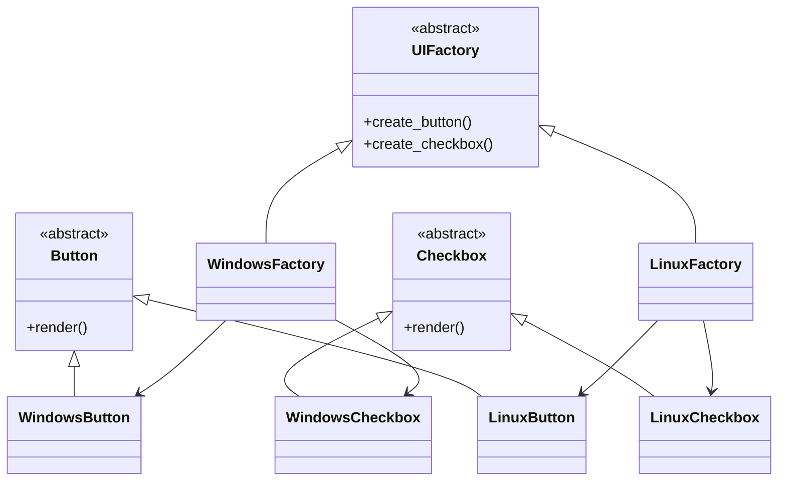
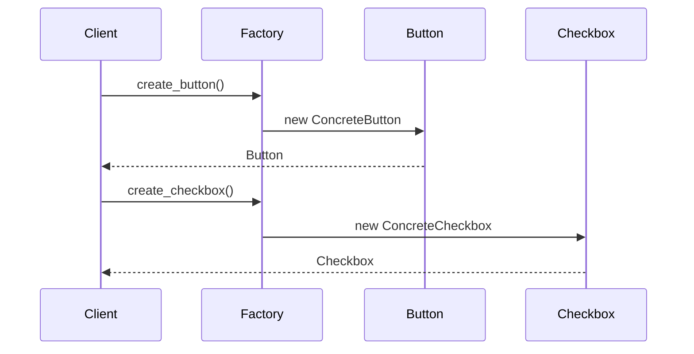
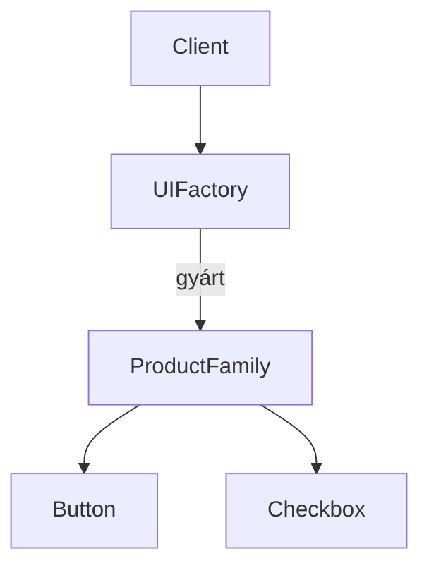

# Abstract Factory (Python) – „objektumcsaládokat gyártunk” tisztán

**Cél:** több kapcsolódó objektum _családot_ (pl. Windows GUI vs Linux GUI) úgy létrehozni, hogy a kliens kódnak **ne kelljen konkrét osztályneveket ismernie**.

> **Kulcsötlet:** a kliens csak _interface-ekkel_ (absztrakt osztályokkal) dolgozik. A konkrét példányosítást a **Factory** végzi.

---

## Mikor használd?

> [!info]
>- Ha több „termékcsaládot” támogatsz (pl. GUI elemek, adatbázis driverek, cache implementációk).
>    
>- Ha fontos, hogy az együtt használt objektumok **kompatibilisek** legyenek (pl. `WindowsButton` + `WindowsCheckbox`).
>  
>- Ha a platform / téma / környezet cserélhető, és nem akarsz `if/else`-t szétszórni a kódban.
>    

---

## A minta felépítése

### 1) Absztrakt termékek (interface-ek / szerződések)

Ezek **nem tartalmaznak üzleti logikát**. Csak azt mondják meg, hogy _mit kell tudnia_ egy Buttonnak vagy Checkboxnak.

```python
from abc import ABC, abstractmethod

class Button(ABC):
    @abstractmethod
    def render(self) -> str:
        """A gomb megjelenítéséért felel (visszaad egy szöveget a példában)."""
        raise NotImplementedError

class Checkbox(ABC):
    @abstractmethod
    def render(self) -> str:
        """A checkbox megjelenítéséért felel (visszaad egy szöveget a példában)."""
        raise NotImplementedError
```

**Miért jó?**

> [!info]
> - Kényszeríti a `render()` metódus meglétét.
> - Ha valaki elrontja (pl. `renderr()`), az hamar kiderül.

---

### 2) Konkrét termékek (itt van a valódi viselkedés)

Itt jön a „logika” (a példában csak stringet adunk vissza, valóságban UI rajzolás, API hívás, stb.).

```python
class WindowsButton(Button):
    def render(self) -> str:
        return "Windows Button"

class WindowsCheckbox(Checkbox):
    def render(self) -> str:
        return "Windows Checkbox"

class LinuxButton(Button):
    def render(self) -> str:
        return "Linux Button"

class LinuxCheckbox(Checkbox):
    def render(self) -> str:
        return "Linux Checkbox"
```

---

### 3) Absztrakt factory (a gyártósor szerződése)

A factory feladata: **összeillő termékeket** adjon vissza.

```python
class UIFactory(ABC):
    @abstractmethod
    def create_button(self) -> Button:
        raise NotImplementedError

    @abstractmethod
    def create_checkbox(self) -> Checkbox:
        raise NotImplementedError
```

---

### 4) Konkrét factory-k (Windows / Linux termékcsalád)

Ezek döntik el, hogy konkrétan _miből_ készül a Button és a Checkbox.

```python
class WindowsFactory(UIFactory):
    def create_button(self) -> Button:
        return WindowsButton()

    def create_checkbox(self) -> Checkbox:
        return WindowsCheckbox()

class LinuxFactory(UIFactory):
    def create_button(self) -> Button:
        return LinuxButton()

    def create_checkbox(self) -> Checkbox:
        return LinuxCheckbox()
```

> [!warning]
> **Fontos:** a `WindowsFactory` soha nem ad vissza Linuxos elemet → így garantált a kompatibilitás.

---

## Kliens kód (a lényeg itt látszik)

A kliens **nem tudja**, milyen konkrét osztály jön, és **nem is érdekli**.  
Csak a szerződéshez ragaszkodik.

```python
def render_ui(factory: UIFactory) -> None:
    button = factory.create_button()
    checkbox = factory.create_checkbox()

    print(button.render())
    print(checkbox.render())
```

Használat:

```python
factory = WindowsFactory()
render_ui(factory)

print("----")

factory = LinuxFactory()
render_ui(factory)
```

Várható kimenet:

```
Windows Button
Windows Checkbox
----
Linux Button
Linux Checkbox
```

---

## Miért működik ez jól?

> [!info]
> - A kliens kód **leválik** a konkrét implementációkról.
>- Egy helyre kerül a „melyik platformot használjuk?” döntés: a factory kiválasztásához.
>- Könnyebb tesztelni: a `UIFactory` könnyen mockolható / cserélhető.

---

## Előnyök

> [!info]
> - **Kompatibilis objektumok** együtt járnak (termékcsalád garancia).
>- Csökkenti a `if os == ...` jellegű szétfolyó logikát.
>- Jó alap moduláris architektúrához és cserélhető implementációkhoz.

---

## Hátrányok

> [!warning]
> - Több osztály, több fájl → **nő a komplexitás**.
>- Kisebb projektnél túlzás lehet (overengineering).

---

## Tipikus hiba (amit kerülj)

Ha a kliens elkezdi ezt csinálni:

```python
if platform == "windows":
    factory = WindowsFactory()
else:
    factory = LinuxFactory()
```

Ez még oké **egyetlen helyen** (pl. konfiguráció / entrypoint).  
De ha ez a logika szétfolyik a projektben, akkor visszacsúszol a káoszba.

> [!tip]
> **Tipp:** platform választás → egy központi helyen (pl. `main.py` / config).

---
### Osztálydiagram – Abstract Factory struktúra



---

### Hogyan olvasd ezt a diagramot?

- **Felső szint:** absztrakt szerződések (`Button`, `Checkbox`, `UIFactory`)
    
- **Középső szint:** konkrét implementációk (Windows / Linux)
    
- **Alsó kapcsolat:** a factory **összeillő objektumokat gyárt**
    

> [!info]
>  A kliens **csak a `UIFactory`-t látja**,  
> minden más **rejtve marad**.

---

### Folyamatdiagram – mi történik futás közben?



**Fontos felismerés:**

> [!info]
> - a kliens **nem példányosít**
>- a kliens **nem dönt platformról**
>- a kliens **csak használ**    

---

### Mentális modell (jegyezd meg)



> **Client → Factory → Objektumcsalád**

Ez a minta **nem objektumot gyárt**,  
hanem **összeillő objektumokat egyszerre**.


---

## Egy mondatos összefoglaló

> [!info] 
> **Abstract Factory = „Adj nekem egy gyártót, és én úgy kapok összeillő objektumokat, hogy nem kell tudnom a konkrét osztályneveket.”**
