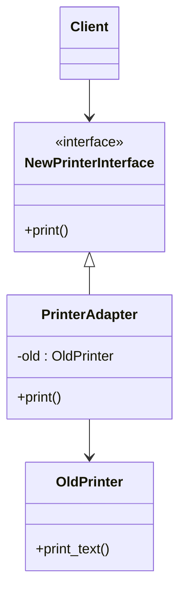
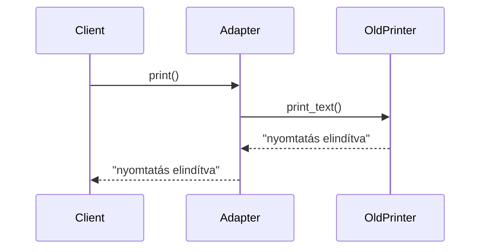
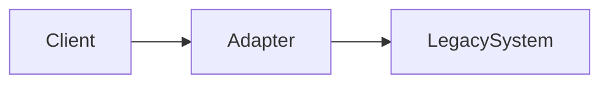

# Adapter Pattern – „összekötjük, ami nem passzol”

> [!info]  
> **Adapter = fordító.**  
> Nem megváltoztatja a meglévő osztályt, hanem **ráhúz egy kompatibilis felületet**, hogy együtt tudjon működni a rendszereddel.

---

## 🎯 Probléma, amit megold

Van egy **meglévő osztályod** (vagy külső library),  
de **nem azt az interfészt adja**, amit a rendszered elvár.

- nem akarod / nem tudod módosítani
- mégis használni akarod

👉 **Adapter**.

---

## 🧠 Mikor használd?

> [!tip]  
> Használd Adaptert, ha:
> 
> - meglévő osztály **nem kompatibilis** az elvárt interfésszel
>     
> - **3rd party library-t** integrálsz
>     
> - régi kódot kell **új rendszerbe bekötni**
>     

> [!warning]  
> Ne használd, ha:
> 
> - te írod az egész rendszert
>     
> - az interfész eleve rajtad múlik  
>     (ott inkább Strategy / sima interface)
>     

---

## 🧩 Szereplők a mintában



### Hogyan olvasd?

- **Client** csak az _új interfészt_ ismeri
    
- **OldPrinter** változatlan marad
    
- **Adapter** fordít a kettő között
    

---

## 🧪 Konkrét példa (Python)

### Régi osztály (nem kompatibilis)

```python
class OldPrinter:
    def print_text(self):
        return "nyomtatás elindítva"
```

> [!note]  
> Ez lehetne:
> 
> - régi belső kód
>     
> - külső library
>     
> - legacy rendszer  
>     👉 **nem nyúlunk hozzá**
>     

---

### Elvárt interfész

```python
class NewPrinterInterface:
    def print(self):
        pass
```

Ez az **új rendszer szerződése**.

---

### Adapter (a kulcs)

```python
class PrinterAdapter(NewPrinterInterface):
    def __init__(self, old_printer):
        self.old = old_printer

    def print(self):
        return self.old.print_text()
```

> [!info]  
> Az Adapter:
> 
> - **implementálja az elvárt interfészt**
>     
> - **delegálja** a hívást a régi osztálynak
>     
> - **átalakítja a metódusneveket / adatokat**
>     

---

### Használat (Client szemszögéből)

```python
printer = PrinterAdapter(OldPrinter())
print(printer.print())
```

Kimenet:

```
nyomtatás elindítva
```

> [!success]  
> A kliens **nem tudja**, hogy adaptert használ.  
> És **nem is kell tudnia**.

---

## 🔄 Folyamatdiagram – mi történik futás közben?



---

## ✅ Előnyök

> [!tip]
> 
> - kompatibilitás biztosítása meglévő kódhoz
>     
> - nincs szükség refaktorálásra
>     
> - tiszta kliens kód (interface-alapú)
>     

---

## ❌ Hátrányok

> [!warning]
> 
> - extra réteg
>     
> - túlhasználva „adapter dzsungel” lehet
>     
> - bonyolultabb debug
>     

---

## 🧠 Mentális modell (jegyezd meg)



> **Client nem alkalmazkodik.  
> A rendszer alkalmazkodik hozzá.**

---

## 🧩 Adapter vs Abstract Factory (1 mondatban)

> [!example]
> 
> - **Adapter**: _összekötünk inkompatibilis dolgokat_
>     
> - **Abstract Factory**: _kompatibilis dolgokat gyártunk_
>     

---

## TL;DR

- Adapter = interfész-átalakító
- legacy / 3rd party kód barátja
- nem módosít, hanem becsomagol
- egyszerű, de nagyon erős minta

