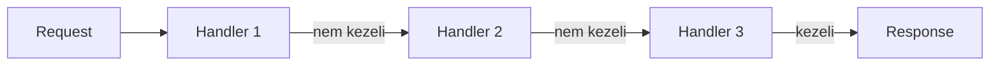

# Chain of Responsibility pattern

A Chain of Responsibility egy viselkedési tervezési minta, ahol egy kérés **egymás után felfűzött objektumokon (handlereken)** halad végig. Minden handler eldönti, hogy **kezeli-e a kérést**, vagy **továbbadja a következőnek**.

A kérés küldője **nem tudja**, hogy végül melyik objektum fogja feldolgozni a kérést – és nem is kell tudnia.

> [!info]  
> A minta lényege: a kérés küldője és a kérés kezelője lazán van csatolva.

---

## Alapgondolat – teljesen kezdő szinten

Képzeld el, hogy van egy biztonsági ellenőrzési lánc:

- belépési ellenőrzés
- jogosultság ellenőrzés
- üzleti szabály ellenőrzés

A kérés végigmegy ezeken sorban. Bármelyik ponton:

- vagy feldolgozzák
- vagy továbbküldik

Ez pontosan a Chain of Responsibility.

---

## A minta szerkezete



---

## Handler szerepe

Egy Handler:

- megkap egy kérést
- eldönti, hogy tudja-e kezelni
- ha nem, továbbadja a következő Handlernek

Ez általában egy közös absztrakt ősosztály vagy interfész segítségével történik.

---

## Egyszerű példa (Python)

```python
class Handler:
    def __init__(self, next_handler=None):
        self.next = next_handler

    def handle(self, req):
        if self.next:
            return self.next.handle(req)
        return None

class AuthHandler(Handler):
    def handle(self, req):
        if req == "auth":
            return "Auth OK"
        return super().handle(req)
```

Ebben a példában az AuthHandler csak akkor dolgozza fel a kérést, ha felismeri. Ha nem, továbbadja.

---

## Tipikus felhasználási esetek

A Chain of Responsibility különösen hasznos, ha:

- több lehetséges feldolgozó van
- nem akarod a döntési logikát egy helyre zsúfolni
- a feldolgozás sorrendje fontos
    

Gyakori példák:

- middleware láncok (HTTP)
- jogosultság-ellenőrzés
- eseményfeldolgozás
- validációs lépések

---

## Előnyök

- rugalmas bővíthetőség
- handler logika jól szeparálható
- új handler könnyen beilleszthető

---

## Hátrányok

- nehéz követni, hol áll meg a kérés
- debugolás bonyolultabb
- könnyű túl hosszú láncot építeni


> [!warning]  
> Ha a lánc túl hosszú, a rendszer átláthatatlanná válik.

---

## Chain of Responsibility vs if-else

if-else esetén:

- egy helyen van minden döntés
- nehéz bővíteni

Chain of Responsibility esetén:

- döntések szétosztva
- bővítés új handlerrel történik

---

## Összefoglalás

> [!summary]  
> A Chain of Responsibility akkor jó választás, ha nem akarod előre eldönteni, melyik objektum kezeli a kérést, és a feldolgozást rugalmasan szeretnéd bővíteni.