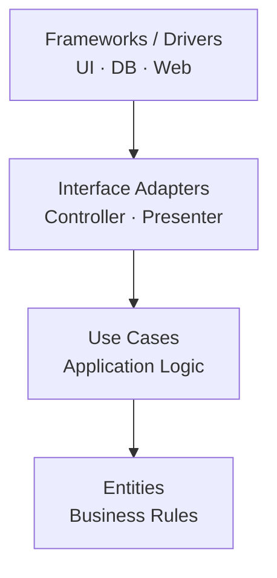
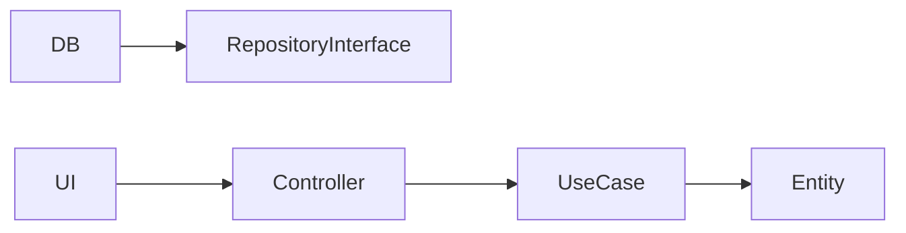
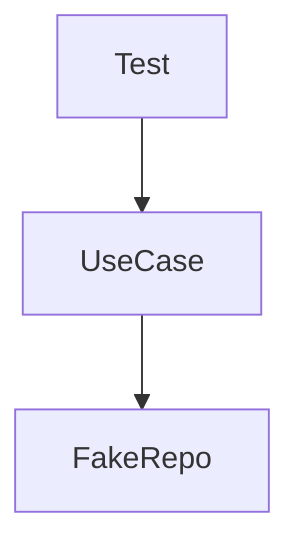
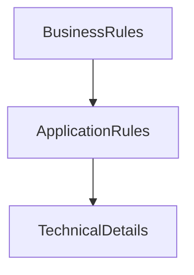

# Clean Architecture – „a rendszered magja érinthetetlen”

> [!info]  
> **Clean Architecture (Uncle Bob)** célja, hogy a **üzleti logika túléljen mindent**:  
> framework cserét, adatbázis váltást, UI újraírást.

Ez **nem framework**, hanem **gondolkodásmód**.

---

## 🧠 Alapötlet (1 mondatban)

> **A rendszer belseje nem tudja, miben fut.**  
> Csak azt tudja, _mit kell csinálnia_.

---

## 🧩 A rétegek (koncentrikus modell)



> [!tip]  
> Minél **beljebb** vagy:
> 
> - annál **stabilabb**
>     
> - annál **függetlenebb**
>     
> - annál **értékesebb** a kód
>     

---

## 🧱 Rétegek részletesen

### 🟢 Entities – üzleti szabályok (MAG)

> [!note]  
> Ez a rendszer **szíve**.

- domain objektumok
- üzleti invariánsok
- tiszta logika
- **nincs framework, nincs DB, nincs UI**

Példa:

```python
class Order:
    def total_price(self):
        ...
```

---

### 🟡 Use Cases – alkalmazás logika

> [!info]  
> Azt írja le, **MIT csinál a rendszer**, nem azt, _hogyan_.

- user story-k logikája
- folyamatok (CreateOrder, PayInvoice)
- Entities-t használ
- **interface-eken keresztül kommunikál kifelé**

---

### 🟠 Interface Adapters – fordítóréteg

> [!example]  
> Ez az Adapter / Presenter világa.

- controller-ek
- presenter-ek
- DTO-k
- adat átalakítás

👉 **külső világ ↔ belső világ fordítása**

---

### 🔴 Frameworks / Drivers – technikai részletek

> [!warning]  
> Ezek **cserélhető eszközök**, nem a rendszer lényege.

- web framework (FastAPI, Laravel, Spring)
- adatbázis (Postgres, Mongo)
- UI (React, CLI)
- külső API-k

👉 itt a „piszkos” technika

---

## 🔑 A LEGFONTOSABB SZABÁLY

```text
A függőségek MINDIG befelé mutatnak.
```



> [!danger]  
> **Belső réteg SOHA nem importálhat külsőt.**
> 
> - nincs ORM az Entity-ben
>     
> - nincs HTTP a Use Case-ben
>     
> - nincs UI logika belül
>     

---

## 🔄 Hogyan beszélnek a rétegek?

> [!info]  
> **Interface + Dependency Inversion**

- belső réteg definiál interface-t
- külső réteg implementálja
- dependency injection köti össze

Ezért:

- DB cserélhető
- UI cserélhető
- tesztelés triviális

---

## 🧪 Tesztelhetőség (itt jön ki az ereje)



> [!success]  
> Use Case teszt:
> 
> - nincs DB
>     
> - nincs web
>     
> - nincs framework  
>     👉 **gyors, stabil, determinisztikus**
>     

---

## ✅ Előnyök

> [!tip]
> 
> - kiváló tesztelhetőség
>     
> - hosszú távon karbantartható
>     
> - technológiafüggetlen core
>     
> - üzleti logika nem rohad el
>     

---

## ❌ Hátrányok

> [!warning]
> 
> - sok interface
>     
> - több fájl, több réteg
>     
> - kis projektnél túlzás lehet
>     
> - tanulási görbe meredek
>     

---

## 🧠 Mentális modell (jegyezd meg)



> **A technológia szolgálja a logikát,  
> nem fordítva.**

---

## 🆚 Clean Architecture vs „klasszikus MVC”

> [!example]
> 
> - **MVC**: gyors indulás, gyors káosz
>     
> - **Clean Architecture**: lassabb indulás, hosszú élet
>     

---

## TL;DR

- Clean Architecture = rétegzett, befelé mutató függőségek
- üzleti logika független a technológiától
- nagy, hosszú életű rendszerekhez ideális
- kis projektnél mérlegelni kell