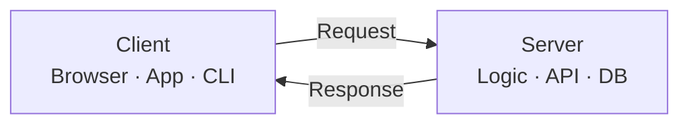
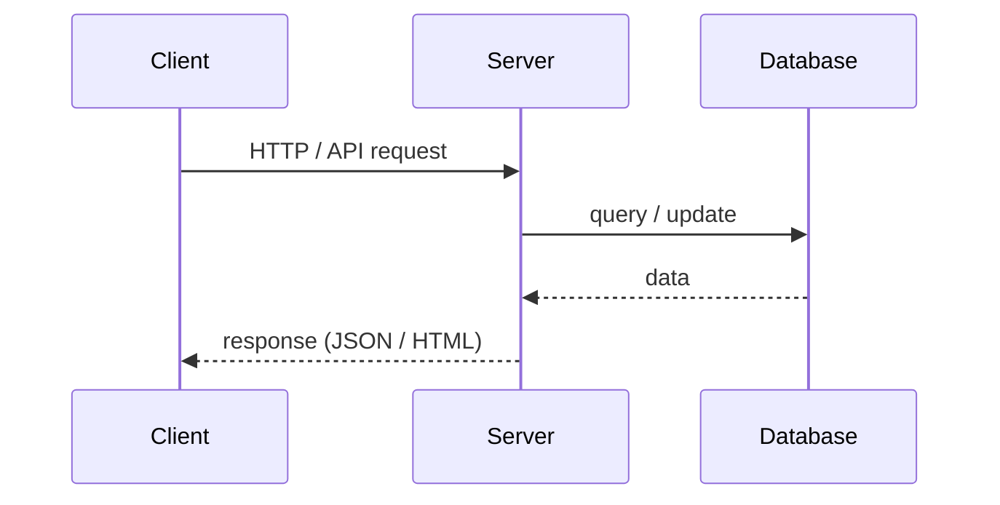
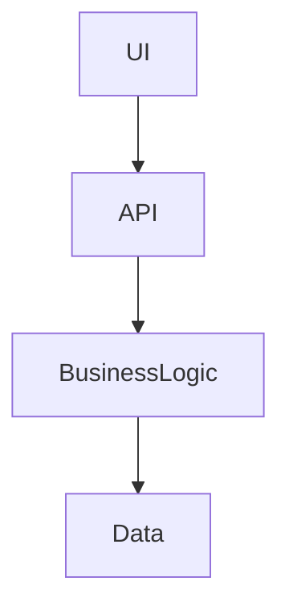
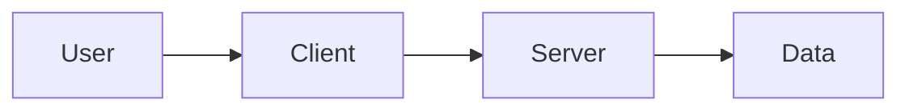

# Client–Server Pattern – „szétválasztjuk, ki kér és ki dolgozik”

> [!info]  
> **Client–Server = felelősségszétválasztás hálózaton keresztül.**  
> A kliens **kér**, a szerver **feldolgoz és válaszol**.  
> A logika nem a felhasználói felületen él.

Ez **nem technológia**, hanem **alap architekturális minta** – web, API, játék, enterprise rendszerek gerince.

---

## 🧠 Alapötlet (1 mondat)

> **A kliens nem tudja, hogyan működik a rendszer.  
> A szerver nem tudja, ki használja.**

---

## 🧩 Alap architektúra (Mermaid – high level)

---

## 🎯 Mikor használd?

> [!tip]  
> Használd Client–Server mintát, ha:
> 
> - több kliens használ ugyanazt az adatot
>     
> - központi adatfeldolgozás kell
>     
> - webes / hálózati rendszert építesz
>     
> - skálázhatóság fontos
>     

> [!warning]  
> Ne használd, ha:
> 
> - minden lokálisan fut
>     
> - nincs szükség megosztott állapotra
>     
> - offline-first az elsődleges cél
>     

---

## 🧩 Tipikus példák

> [!example]
> 
> - **Webbrowser → Webszerver**
>     
> - **Mobil app → REST API**
>     
> - **CLI tool → Backend service**
>     
> - **Game client → Game server**
>     

---

## 🔄 Mi történik valójában? (Sequence diagram)

> [!note]  
> A kliens **soha nem beszél közvetlenül az adatbázissal**.  
> A szerver a kapu.

---

## 🧱 Szerepkörök tisztán

### 🟢 Client (kliens)

- UI / UX
- felhasználói interakció
- request összeállítás
- response megjelenítés

❌ üzleti logika  
❌ adatfeldolgozás

---

### 🔵 Server (szerver)

- üzleti logika
- validáció
- adatkezelés
- jogosultság

❌ UI  
❌ kliens-specifikus logika

---

## 🔑 Miért fontos ez a szétválasztás?

> [!success]  
> Ha a kliens változik (pl. web → mobil),  
> a szerver **maradhat ugyanaz**.

---

## ✅ Előnyök

> [!tip]
> 
> - kliens és szerver **függetlenül fejleszthető**
>     
> - több kliens (web, mobil, desktop) egy backendhez
>     
> - horizontális skálázás lehetséges
>     
> - biztonságosabb adatkezelés
>     

---

## ❌ Hátrányok

> [!warning]
> 
> - hálózatfüggőség (latency, timeout)
>     
> - szerver túlterhelődhet
>     
> - hibakezelés bonyolultabb
>     
> - offline mód extra munka
>     

---

## 🧠 Mentális modell (jegyezd meg)

> **A kliens kér.  
> A szerver gondolkodik.  
> Az adat nem hagyja el a szervert.**

---

## 🆚 Client–Server vs Monolit lokális app

> [!example]
> 
> - **Lokális app**: gyors, egyszerű, nem skálázódik
>     
> - **Client–Server**: komplexebb, de együttműködő és skálázható
>     

---

## TL;DR

- Client–Server = kérés–válasz modell
- UI és logika elválasztva
- web és hálózati rendszerek alapja
- skálázható, de hálózatfüggő
