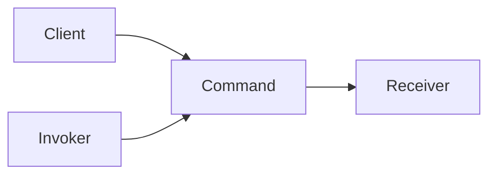

# Command pattern

A Command pattern egy viselkedési tervezési minta, amelyben egy műveletet **objektumként reprezentálunk**. A kérés (mit szeretnénk csinálni) és a végrehajtás (hogyan történik meg) **szét van választva**.

Ennek köszönhetően a parancs:

- eltárolható
- sorba állítható
- naplózható
- visszavonható (undo / redo)

> [!info]  
> A Command pattern lényege: a művelet nem egy metódushívás, hanem egy objektum.

---

## Alapgondolat – teljesen kezdő szinten

Normál esetben így gondolkodunk:

"Kapcsold fel a lámpát" → közvetlenül meghívunk egy metódust.

A Command patternnél így:

"Kapcsold fel a lámpát" → létrejön egy **parancs objektum**, amit később végrehajthatunk.

Ez a különbség teszi lehetővé az undo, redo, queue és log funkciókat.

---

## A minta szerkezete



Röviden:

- Client: létrehozza a parancsot
- Invoker: meghívja a parancsot
- Command: definiálja az interfészt
- Receiver: ténylegesen végrehajtja a műveletet

---

## Command interfész

A Command egy egységes interfészt biztosít, jellemzően egy `execute()` metódussal.

```python
class Command:
    def execute(self):
        pass
```

Minden konkrét parancs ezt valósítja meg.

---

## Konkrét Command példa

```python
class LightOn(Command):
    def execute(self):
        return "Fény bekapcsolva"
```

Ez az objektum egyetlen dolgot tud: végrehajtani a saját műveletét.

---

## Invoker szerepe

Az Invoker az, aki **nem tudja**, mit csinál a parancs, csak azt, hogy végre kell hajtania.

```python
class Remote:
    def submit(self, command):
        return command.execute()
```

Ez a szétválasztás a minta egyik legfontosabb előnye.

---

## Tipikus használat

```python
remote = Remote()
remote.submit(LightOn())
```

Az Invoker nem tudja, mi az a LightOn, csak azt, hogy van egy parancs, amit végre kell hajtani.

---

## Mikor érdemes használni?

A Command pattern különösen hasznos, ha:

- undo / redo funkcionalitás kell
- műveleteket sorba akarsz állítani (queue)
- naplózni szeretnéd a végrehajtott parancsokat
- el akarod választani a kérést a végrehajtástól

Gyakori példák:

- grafikus szerkesztők
- tranzakciókezelés
- háttérfeladatok
- CQRS command oldala

---

## Előnyök

- undo / redo alapja
- tiszta szétválasztás a kérés és végrehajtás között
- parancsok könnyen kombinálhatók

---

## Hátrányok

- sok kis osztály
- elsőre bonyolultabb struktúra
- túlhasználva túlbonyolít

> [!warning]  
> Ha nincs szükség undo, queue vagy log funkcióra, a Command pattern gyakran felesleges.

---

## Command vs Chain of Responsibility

Command:

- egy parancs = egy művelet
- végrehajtás fókusz

Chain of Responsibility:

- több handler
- eldönti, ki kezeli a kérést

---

## Összefoglalás

> [!summary]  
> A Command pattern akkor erős, amikor a műveleteknek saját életciklusuk van: eltárolhatók, újrajátszhatók vagy visszavonhatók. Egyszerű CRUD esetén viszont felesleges bonyolítás.