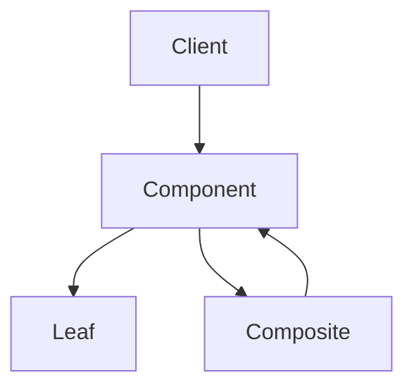

# Composite Pattern – „egy és sok ugyanaz a szemszögből”

**Cél:**  
Lehetővé teszi, hogy **egyedi objektumokat (leaf)** és **objektumcsoportokat (composite)** **ugyanazzal az interfésszel** kezeljünk.

> **Kulcsötlet:**  
> a kliens **nem tesz különbséget** egy elem és egy elemcsoport között.

---

## Mikor használd?

> [!info]
> 
> - Ha **hierarchikus, fa-szerkezetű** adatod van (pl. fájlrendszer, UI komponensek).
>     
> - Ha egységesen akarod kezelni az „egyet” és a „sokat”.
>     
> - Ha rekurzív struktúrában gondolkodsz.
>     

Tipikus példák:

- fájl ↔ mappa
    
- UI elem ↔ UI konténer
    
- menüpont ↔ almenü
    

---

## A probléma, amit megold

### ❌ Külön kezelés

```python
if isinstance(item, File):
    item.open()
elif isinstance(item, Folder):
    for f in item.files:
        f.open()
```

- tele `if`-ekkel
    
- nehéz bővíteni
    
- kliens tud túl sokat
    

---

## A Composite alapötlete

```text
Component
 ├─ Leaf
 └─ Composite (tartalmaz Componenteket)
```

- **Leaf**: tényleges elem
    
- **Composite**: elemek gyűjteménye
    
- mindkettő **ugyanazt az interfészt** valósítja meg
    

---

## Példa – Graphic fa

### Közös interfész

```python
from abc import ABC, abstractmethod

class Graphic(ABC):
    @abstractmethod
    def draw(self):
        pass
```

### Leaf

```python
class Circle(Graphic):
    def draw(self):
        return "Circle"
```

### Composite

```python
class Group(Graphic):
    def __init__(self):
        self.children: list[Graphic] = []

    def add(self, graphic: Graphic):
        self.children.append(graphic)

    def draw(self):
        return [child.draw() for child in self.children]
```

### Használat

```python
group = Group()
group.add(Circle())

group2 = Group()
group2.add(Circle())
group2.add(group)

print(group2.draw())
```

👉 a kliens **nem tudja**, hogy egy vagy sok elemmel dolgozik.

---

## Rekurzió természetesen jön

> [!info]  
> Mivel a Composite is `Graphic`, ezért önmagát is tartalmazhatja közvetve.

```text
Group
 ├─ Circle
 └─ Group
     └─ Circle
```

Ezért ideális fára, DOM-ra, UI-ra.

---

## Való élet példák

> [!info]
> 
> - fájlrendszer (File / Directory)
>     
> - UI frameworkök (Component / Container)
>     
> - JSON / XML struktúrák
>     
> - szervezeti hierarchia
>     

---

## Előnyök

> [!info]
> 
> - Egységes kezelés
>     
> - Rekurzív feldolgozás egyszerű
>     
> - Kliens kód letisztult
>     

---

## Hátrányok

> [!warning]
> 
> - Debugolás nehezebb (mély rekurzió)
>     
> - Nehéz korlátozni, mit tartalmazhat egy Composite
>     

---

## Composite vs Decorator (gyakori keverés)

|Composite|Decorator|
|---|---|
|Fa-szerkezet|Lánc-szerkezet|
|Részek + egész|Funkció hozzáadás|
|Struktúra|Viselkedés|

---

## Mentális modell



---

## Tipikus hiba

```python
class Group:
    def draw(self):
        for child in self.children:
            if isinstance(child, Circle):
                ...
```

👉 ha `isinstance` kell, **elrontottad a mintát**.

---

## Egy mondatos összefoglaló

> **Composite = kezeld ugyanúgy az egy elemet és az elemek csoportját, és a kliens kód megkönnyebbül.**