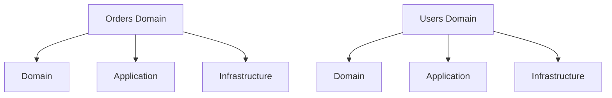
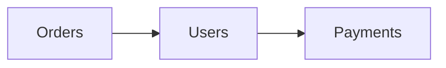

# Domain-Driven Organization (DDO) – „a kód a domain nyelvén beszél”

> [!info]  
> **Domain-Driven Organization = a projektet nem technológia, hanem üzleti fogalmak szerint szervezed.**  
> Nem az a kérdés, hogy _controller vagy service_,  
> hanem hogy **Orders**, **Users**, **Payments**.

Ez **nem pattern**, hanem **szervezési elv**.  
És ha egyszer ráérzel, **nem akarsz visszamenni**.

---

## 🧠 Alapötlet (1 mondatban)

> **A mappastruktúra tükrözze a domain-t, ne a frameworköt.**

Nem:

```
controllers/
services/
repositories/
```

Hanem:

```
orders/
users/
payments/
```

---

## 🎯 Mikor használd?

> [!tip]  
> Használd DDO-t, ha:
> 
> - a domain logika a rendszer lényege
>     
> - több, jól elkülöníthető üzleti területed van
>     
> - moduláris monolitot vagy microservice-t építesz
>     
> - hosszú életű rendszert tervezel
>     

> [!warning]  
> Ne erőltesd, ha:
> 
> - nagyon kicsi a projekt
>     
> - CRUD app 2 táblával
>     
> - a domain még teljesen bizonytalan
>     

---

## 🧩 Példa projektstruktúra (domain-centrikus)

```text
orders/
  ├── domain/
  │     ├── Order.py
  │     └── OrderPolicy.py
  ├── application/
  │     └── CreateOrder.py
  ├── infrastructure/
  │     └── OrderRepositorySQL.py

users/
payments/
```

> [!note]  
> **Minden domain saját mini világ.**  
> Nem keveredik a többivel.

---

## 🧠 Hogyan viszonyul ez a Clean Architecture-hez?

> [!example]  
> A DDO **nem helyettesíti**, hanem **szervezi** a Clean Architecture-t.



👉 **Domain kívülről**, rétegek **belül**.

---

## 🔄 Mentális modell (EZ A KULCS)



> Nem fájlok beszélnek egymással,  
> hanem **üzleti kontextusok**.

---

## 🧩 DDO vs technikai réteges szervezés

> [!example]  
> **Technikai (rossz hosszú távon):**
> 
> ```
> controllers/
> services/
> repositories/
> ```

> **Domain-vezérelt (skálázható):**
> 
> ```
> orders/
> users/
> payments/
> ```

Miért jobb?

- nem kell 5 mappát megnyitni egy feature-höz
- minden, ami az „Order”-hez tartozik, **egy helyen van**

---

## 🔑 Kapcsolat a Domain-Driven Designnal (DDD)

> [!info]  
> DDO gyakran **DDD-ből nő ki**, de:
> 
> - DDO = struktúra
>     
> - DDD = módszertan
>     

Fogalmak, amik jól passzolnak:

- Bounded Context
- Aggregate
- Ubiquitous Language

---

## ✅ Előnyök

> [!tip]
> 
> - könnyebb karbantartás
>     
> - domain összefüggések egy helyen
>     
> - moduláris gondolkodás
>     
> - előkészíti a microservice bontást
>     

---

## ❌ Hátrányok

> [!warning]
> 
> - kezdőknek szokatlan
>     
> - refaktorálásnál fegyelem kell
>     
> - rossz domain felosztással káosz lehet
>     

---

## ⚠️ Tipikus hibák

> [!danger]
> 
> - „minden domain egy CRUD”
>     
> - technikai osztálynevek visszalopása (`OrderServiceHelperUtil`)
>     
> - domain határok elmosása
>     
> - túl korai microservice bontás
>     

---

## 🧠 Mentális mondat (jegyezd meg)

> **Ha a mappanév üzleti fogalom, jó úton jársz.  
> Ha technikai szó, gyanakodj.**

---

## TL;DR

- DDO = domain-alapú projektstruktúra
- a kód az üzleti nyelvet tükrözi
- jól illeszkedik Clean Architecture-hez
- nagyobb rendszereknél nagyon erős