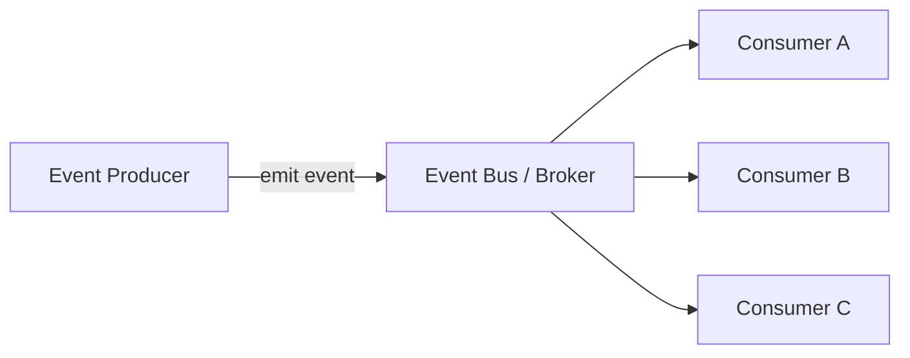
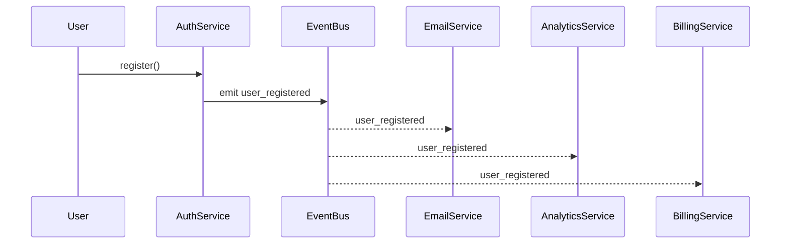
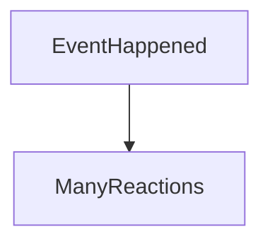

# Event-Driven Architecture (EDA) – „nem hívunk, reagálunk”

> [!info]  
> **Event-Driven Architecture = események köré szervezett rendszer.**  
> A komponensek **nem ismerik egymást**,  
> csak **eseményeket publikálnak**, és **eseményekre reagálnak**.

Ez **nem technológia**, hanem **kommunikációs modell**.

---

## 🧠 Alapötlet (1 mondatban)

> **Valami történt → esemény születik → bárki reagálhat.**

Nincs:

- direkt metódushívás
- szoros függőség
- „ki kit hív” lánc

---

## 🧩 Alap architektúra (Mermaid – high level)

> [!note]  
> A Producer **nem tudja**, kik a Consumerök.  
> A Consumerök **nem tudják**, ki volt a Producer.

Ez a laza csatolás lényege.

---

## 🎯 Mikor használd?

> [!tip]  
> Használd EDA-t, ha:
> 
> - **aszinkron működés** kell
>     
> - sok komponens reagál ugyanarra az eseményre
>     
> - skálázható, elosztott rendszert építesz
>     
> - microservice architektúrában gondolkodsz
>     

> [!warning]  
> Ne használd, ha:
> 
> - egyszerű, lineáris üzleti folyamat van
>     
> - szigorú tranzakciós sorrend kell
>     
> - a rendszer kicsi és lokális
>     

---

## 🧪 Klasszikus példa (üzleti esemény)

> [!example]  
> **Felhasználó regisztrál**
> 
> → `user_registered` esemény  
> → Email service: üdvözlő email  
> → Analytics: statisztika  
> → Billing: trial indítása

---

## 🧱 Fő szereplők

### 🟢 Event Producer

- eseményt publikál
- nem vár választ
- nem ismeri a fogyasztókat

### 🔵 Event Bus / Broker

- eseményeket közvetít
- queue / topic alapú
- pl. Kafka, RabbitMQ, SNS, SQS

### 🟠 Event Consumer

- feliratkozik eseményre
- saját logikát futtat
- egymástól függetlenek

---

## 🔑 Fontos szabályok

> [!danger]
> 
> - Event **múlt idő** (valami már megtörtént)
>     
> - Event **immutable** (nem módosítjuk)
>     
> - Event **tény**, nem parancs
>     

❌ `CreateUserEvent`  
✅ `UserCreated`

---

## 🔄 Mentális modell (jegyezd meg)

> **Egy ok – sok következmény.**  
> A rendszer így válik skálázhatóvá.

---

## 🧪 Hibakezelés és valóság

> [!warning]  
> Az EDA **nem varázslat**.

Valós problémák:

- esemény elveszik
- consumer hibázik
- feldolgozás késik
- duplikált események

Ezért kell:

- retry
- idempotencia
- dead letter queue (DLQ)
- monitoring & tracing

---

## 🆚 Event-Driven vs Request-Response

> [!example]
> 
> - **Request–Response**: gyors, egyszerű, szoros csatolás
>     
> - **Event-Driven**: laza, skálázható, komplexebb
>     

Nem egymás ellenségei – **gyakran együtt használjuk**.

---

## ✅ Előnyök

> [!tip]
> 
> - laza csatolás
>     
> - kiváló skálázhatóság
>     
> - új consumer hozzáadása nem tör meg semmit
>     
> - jól illeszkedik microservice-ekhez
>     

---

## ❌ Hátrányok

> [!warning]
> 
> - komplex hibakezelés
>     
> - nehéz debugolni
>     
> - trace-elés nélkül „láthatatlan” folyamatok
>     
> - tanulási görbe meredekebb
>     

---

## 🧠 Tipikus hibák

> [!danger]
> 
> - mindenre event (overengineering)
>     
> - üzleti logika szétszórása kontroll nélkül
>     
> - event verziózás elhanyagolása
>     
> - szinkron logika eventbe erőltetése
>     

---

## 🧠 Mentális mondat (jegyezd meg)

> **Nem kérde és nem válaszol.  
> Közöl. A világ reagál.**

---

## TL;DR

- Event-Driven = események mentén kommunikáló rendszer
- laza csatolás, jó skálázás
- komplexebb hibakezelés és debug
- nagy, elosztott rendszerekhez ideális
