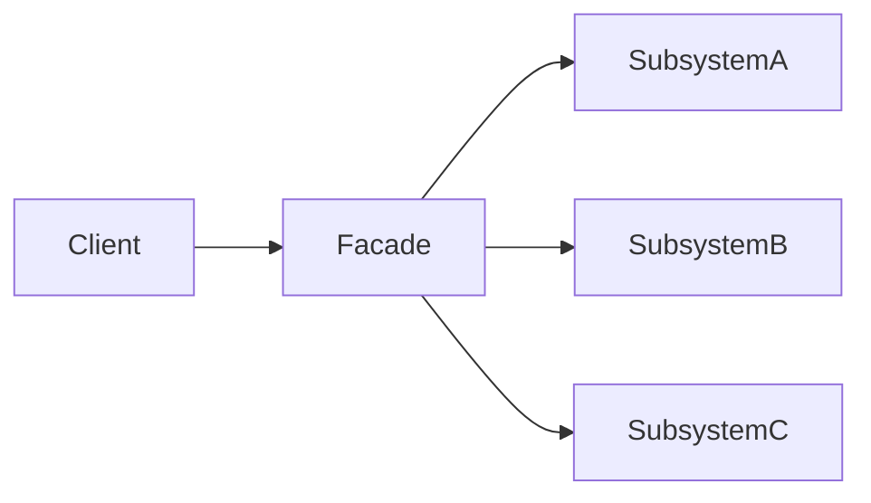

# Facade Pattern – „egy ajtó a káosz elé”

**Cél:**  
Egy **egyszerű, jól érthető interfészt** biztosít egy **bonyolult alrendszerhez**, miközben a komplexitást elrejti a kliens elől.

> **Kulcsötlet:**  
> a kliens **nem akarja érteni** a belső működést, csak használni.

---

## Mikor használd?

> [!info]
> 
> - Ha egy rendszer belső működése túl összetett a kliens számára.
>     
> - Ha **egységes belépési pontot** akarsz biztosítani.
>     
> - Ha csökkenteni akarod a kliens és az alrendszer közti csatolást.
>     

Tipikus helyzet:

```text
Client -> SubsystemA
       -> SubsystemB
       -> SubsystemC
```

👉 Facade kell.

---

## A probléma, amit megold

### ❌ Kliens oldali káosz

```python
cpu.freeze()
memory.load()
disk.read()
cpu.execute()
```

- sorrendfüggő
    
- könnyű elrontani
    
- kliens túl sokat tud
    

---

## A Facade alapötlete

```text
Client -> Facade -> Subsystemek
```

- a kliens **csak a Facade-dal beszél**
    
- az alrendszer marad komplex, de el van rejtve
    

---

## Példa – Computer indítás

### Alrendszer osztályok

```python
class CPU:
    def freeze(self):
        print("CPU freeze")

    def execute(self):
        print("CPU execute")

class Memory:
    def load(self):
        print("Memory load")
```

### Facade

```python
class Computer:
    def __init__(self):
        self.cpu = CPU()
        self.memory = Memory()

    def start(self):
        self.cpu.freeze()
        self.memory.load()
        self.cpu.execute()
```

### Használat

```python
computer = Computer()
computer.start()
```

👉 a kliens **nem tud a belső lépésekről**.

---

## Miért jó ez?

> [!info]
> 
> - A sorrendiség **egy helyen van**.
>     
> - A kliens kód tiszta marad.
>     
> - Az alrendszer szabadon változhat.
>     

---

## Való élet példák

> [!info]
> 
> - ORM-ek (save(), delete())
>     
> - Framework entrypointok
>     
> - API Service layer
>     
> - DevOps script wrapper-ek
>     

---

## Facade vs Adapter (gyakori keverés)

|Facade|Adapter|
|---|---|
|Egyszerűsít|Átalakít|
|Új API|Meglévő API kompatibilissé tétele|
|Komfort|Kompatibilitás|

---

## Előnyök

> [!info]
> 
> - Egyszerű használat
>     
> - Csökkentett csatolás
>     
> - Modulárisabb rendszer
>     

---

## Hátrányok

> [!warning]
> 
> - A komplexitás nem szűnik meg, csak elrejtőzik
>     
> - Túlságosan vastag Facade veszélyes
>     

---

## Tipikus hiba

```python
class Computer:
    def start(self):
        self.cpu.freeze()
        self.memory.load()
        self.cpu.execute()
        self.disk.read()
        self.network.connect()
        self.logger.log()
```

👉 ha minden ide kerül, a Facade **god object** lesz.

---

## Mentális modell



---

## Egy mondatos összefoglaló

> **Facade = adj egy egyszerű ajtót a komplex rendszer elé, és ne engedd be a klienst a gépházba.**