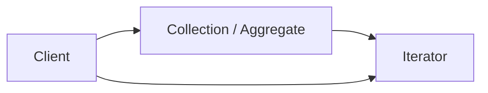

# Iterator pattern

Az Iterator pattern egy viselkedési tervezési minta, amely lehetővé teszi, hogy egy gyűjtemény (kollekció) elemein **sorban végigmenjünk** anélkül, hogy ismernünk kellene a gyűjtemény belső felépítését (tömb, lista, fa, gráf, adatbázis-lekérdezés, stb.).

A minta lényege, hogy a bejárás logikáját (iterációt) **külön objektumba** vagy egységes interfészbe szervezi.

> [!info]  
> Alapgondolat: bejárás egységesen, a kollekció belső szerkezetének ismerete nélkül.

---

## Alapgondolat – teljesen kezdő szinten

Ha van egy gyűjteményed (pl. lista), gyakran szeretnéd ezt csinálni:

- elemenként végigmenni rajta
    
- közben nem érdekel, hogy belül tömb-e, láncolt lista-e, fa-e
    

Az Iterator pattern ezt oldja meg:

- a gyűjtemény ad egy iterátort
    
- az iterátor tudja, hogyan kell végigmenni
    

Így a kódod nem lesz tele olyan logikával, hogy "ha tömb, akkor indexelünk, ha fa, akkor DFS".

---

## A minta szerkezete



- Aggregate: maga a gyűjtemény
    
- Iterator: a bejárásért felelős objektum
    
- Client: aki bejárja az elemeket
    

---

## Tipikus Iterator műveletek

Egy klasszikus iterator interfész általában tudja:

- `hasNext()` – van-e még elem
    
- `next()` – következő elem
    
- opcionálisan `current()` vagy `reset()`
    

Modern nyelvekben ez sokszor nyelvi szinten támogatott (pl. `for ... in`, `foreach`).

---

## Példa (Python)

Pythonban az iterator protokoll:

- `__iter__()` visszaad egy iterátort
    
- `__next__()` visszaadja a következő elemet, vagy `StopIteration`
    

```python
class MyCollection:
    def __init__(self, items):
        self.items = items

    def __iter__(self):
        return MyIterator(self.items)

class MyIterator:
    def __init__(self, items):
        self.items = items
        self.index = 0

    def __iter__(self):
        return self

    def __next__(self):
        if self.index >= len(self.items):
            raise StopIteration
        value = self.items[self.index]
        self.index += 1
        return value

# Használat
col = MyCollection([1, 2, 3])
for x in col:
    print(x)
```

---

## Mikor használd?

Az Iterator pattern akkor hasznos, ha:

- többféle belső adatszerkezetet akarsz egységesen bejárni
    
- a bejárás logikája bonyolult (pl. fa, gráf, szűrések, lapozás)
    
- többféle bejárás kell ugyanarra a kollekcióra (pl. BFS vs DFS)
    

Gyakori helyek:

- adatszerkezetek (fa, gráf)
    
- adatbázis cursorok
    
- fájlrendszer bejárás
    
- stream-ek
    

> [!note]  
> Sok nyelvben a beépített `foreach` mögött is iterator-szemlélet van.

---

## Előnyök

- egységes bejárás többféle kollekcióhoz
    
- a kollekció belső szerkezete elrejthető
    
- a bejárás logikája külön kezelhető és tesztelhető
    

---

## Hátrányok

- több osztály / több absztrakció
    
- egyszerű listákhoz túlzás lehet
    
- hibás iterátor implementáció esetén nehezebb debugolni
    

> [!warning]  
> Ne csinálj saját iterátort csak azért, mert "design pattern" – ha a nyelv natívan kezeli, használd azt.

---

## Iterator vs Command (gyors különbség)

- Iterator: bejárásra szolgál (adatok sorrendi elérése)
    
- Command: műveletek objektumként kezelése (execute, undo, queue)
    

---

## Összefoglalás

> [!summary]  
> Az Iterator pattern a bejárás problémáját oldja meg: a kliens ugyanúgy tud végigmenni bármilyen gyűjteményen, miközben a bejárás logikája elkülönül és cserélhető.

