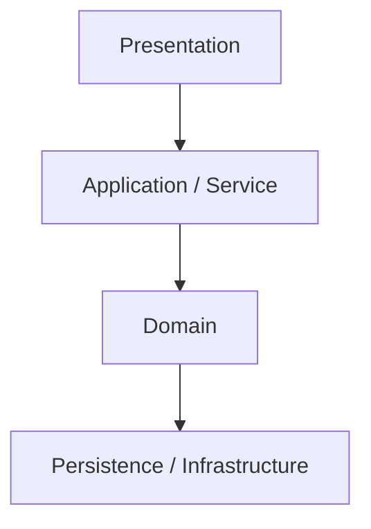
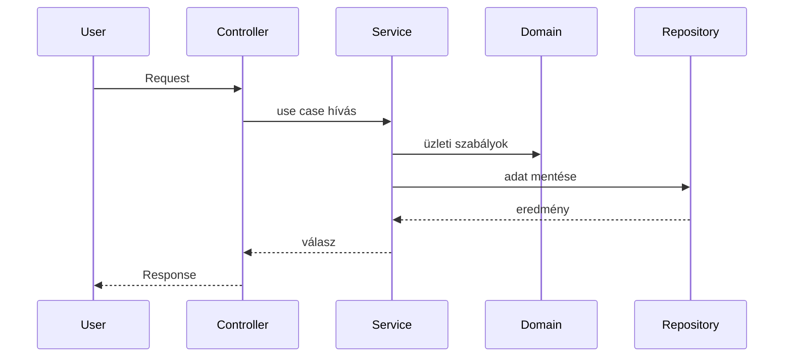

A Layered Architecture (réteges architektúra) egy szoftvertervezési minta, ahol a rendszert **logikailag elkülönített rétegekre bontjuk**, és minden rétegnek pontosan meghatározott felelőssége van. A rétegek közötti kommunikáció **egyirányú: felülről lefelé** történik.

A cél az, hogy a különböző problématípusok ne keveredjenek. A felhasználói felület nem tartalmaz üzleti logikát, az üzleti logika nem tud az adatbázisról, az adatbázis-kezelés pedig nem hoz üzleti döntéseket.

> [!info]  
> Alapszabály: felső réteg használja az alsót, az alsó nem tud a felsőről.

---

## Alapgondolat – teljesen kezdő szinten

Gondolkodj úgy a rendszerről, mint egy szervezetről:

- a felhasználó beszél a felülettel
- a felület továbbítja a kérést
- a belső logika eldönti, mi történhet
- az adatbázis csak eltárolja az adatot

Ha ezek össze vannak keverve, a rendszer gyorsan átláthatatlanná válik. A Layered Architecture ezt akadályozza meg.

---

## Rétegek áttekintése

> [!note]  
> A nyilak iránya nem véletlen: a hívások mindig lefelé mennek.

---

## Presentation réteg

Ez a réteg kezeli a **felhasználóval való kapcsolatot**. Ide tartozik minden, ami belépési pont a rendszerbe.

Tipikus elemek:

- webes UI
- API controller
- REST endpoint
- Livewire / React komponens

Feladatai:

- kérések fogadása
- formai validáció
- autentikáció és autorizáció
- válasz visszaadása

> [!warning]  
> A Presentation réteg nem tartalmaz üzleti logikát. Ha itt szabályokat hozol, a rendszer szét fog csúszni.

---

## Application / Service réteg

Ez a réteg a rendszer **folyamatlogikáját** kezeli. Itt jelennek meg az úgynevezett use case-ek.

Példák:

- entitás létrehozása
- műveletek összekapcsolása
- tranzakciók kezelése

Ez a réteg koordinálja a Domain réteg működését, de nem tartalmazza magukat az üzleti szabályokat.

> [!note]  
> Az Application réteg tudja, hogy mi történjen, de nem tudja, hogyan van eltárolva az adat.

---

## Domain réteg

A Domain réteg a rendszer **szíve**. Itt van minden, ami üzleti értelemben fontos.

Ide tartozik:

- entitások
- value objectek
- üzleti szabályok
- invariánsok

Példák üzleti szabályokra:

- csak aktív felhasználó végezhet műveletet
- egy dátum nem lehet a jövőben

> [!warning]  
> Ha a Domain réteg tud adatbázisról, frameworkről vagy HTTP-ről, akkor a rétegzés hibás.

---

## Persistence / Infrastructure réteg

Ez a réteg kezeli a **technikai részleteket**.

Ide tartozik:

- adatbázis
- ORM (pl. Eloquent)
- repository implementációk
- külső API-k

Feladata az adatok tárolása és visszaadása, nem az üzleti döntések meghozatala.

---

## Tipikus adatfolyam

---

## Előnyök

- jól strukturált
- könnyen tesztelhető
- hosszú távon karbantartható

## Hátrányok

- kis projektnél túlzás lehet
- több fájl és absztrakció
- könnyű overengineeringbe esni

> [!summary]  
> A Layered Architecture lényege, hogy minden réteg csak a saját feladatával foglalkozik, és nem szól bele más rétegek dolgába.