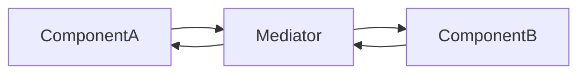

# Mediator Pattern – „ne egymással beszéljenek, hanem rajtam keresztül”

**Cél:**  
Egy **központi objektum (Mediator)** koordinálja a komponensek közötti kommunikációt, így azok **nem hívják közvetlenül egymást**.

> **Kulcsötlet:**  
> a komponensek **nem ismerik egymást**, csak a mediátort.

---

## Mikor használd?

> [!info]
> 
> - Ha sok komponens **össze-vissza hívogatja egymást**.
>     
> - Ha a kapcsolatok száma már követhetetlen.
>     
> - Ha laza csatolásra és központi vezérlésre van szükség.
>     

Ha ilyet látsz:

```text
Button -> Dialog
Dialog -> Input
Input -> Button
Checkbox -> Button
```

👉 Mediator kell.

---

## A probléma, amit megold

### ❌ Spagetti kommunikáció

```python
button.on_click = lambda: dialog.close()
input.on_change = lambda: button.disable()
checkbox.on_toggle = lambda: input.clear()
```

- minden mindent ismer
    
- változtatás = dominóeffektus
    

---

## A Mediator alapötlete

```text
Component -> Mediator -> Component
```

- a komponensek csak **jeleznek**
    
- a döntés **középen történik**
    

---

## Példa – alap Mediator

### Mediator interfész

```python
from abc import ABC, abstractmethod

class Mediator(ABC):
    @abstractmethod
    def notify(self, sender, event: str):
        pass
```

### Konkrét Mediator

```python
class ConcreteMediator(Mediator):
    def notify(self, sender, event: str):
        print(f"Mediator kapta: {event} from {sender}")
```

### Komponens

```python
class Component:
    def __init__(self, mediator: Mediator):
        self.mediator = mediator

    def do_something(self):
        self.mediator.notify(self, "történt valami")
```

### Használat

```python
mediator = ConcreteMediator()
component = Component(mediator)
component.do_something()
```

---

## Valósabb példa – UI dialog

> [!info]  
> Klasszikus GoF példa.

```text
Button clicked -> Mediator
Mediator -> disable Button
Mediator -> close Dialog
Mediator -> update Input
```

A komponensek **nem tudnak egymásról**, csak eseményt küldenek.

---

## Mediator vs Observer (nagyon gyakori keverés)

|Mediator|Observer|
|---|---|
|Központi vezérlés|Esemény szórás|
|Tud a résztvevőkről|Nem tud a hallgatókról|
|Koordináció|Értesítés|

> **Mediator = dönt**  
> **Observer = értesít**

---

## Előnyök

> [!info]
> 
> - Jelentősen csökken a csatolás
>     
> - Kommunikáció egy helyen
>     
> - Komponensek újrafelhasználhatók
>     

---

## Hátrányok

> [!warning]
> 
> - A Mediator könnyen **God Objectté** válhat
>     
> - Túl sok szabály egy helyen
>     

---

## Tipikus hiba

```python
class Mediator:
    def notify(self, sender, event):
        if event == 'a': ...
        if event == 'b': ...
        if event == 'c': ...
        if event == 'd': ...
```

👉 ha itt nő a `if/else`, a Mediator **túlhízott**.

---

## Mentális modell



---

## Egy mondatos összefoglaló

> **Mediator = vedd ki a komponensek kezéből a döntést, és tedd egy központi agyba.**