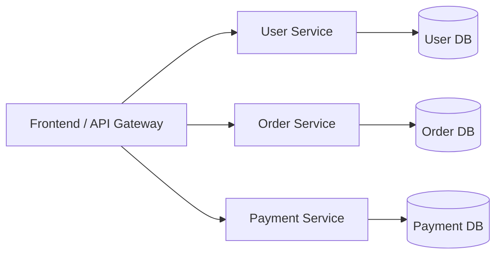
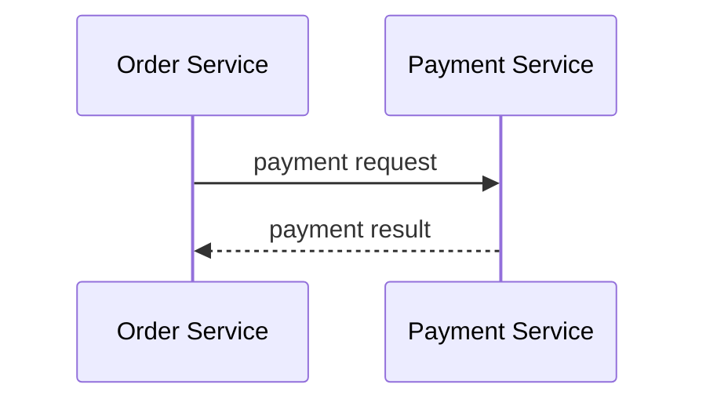

# Microservices Pattern

A Microservices pattern egy olyan architekturális megközelítés, ahol a rendszer **sok kicsi, egymástól független szolgáltatásra** van bontva. Minden szolgáltatás egy jól körülhatárolt üzleti funkcióért felel, saját kódbázissal, gyakran saját adatbázissal, és önállóan deployolható.

A microservice nem egy "kisebb modul", hanem egy **önálló alkalmazás**, amely más szolgáltatásokkal hálózaton keresztül kommunikál.

> [!info]  
> Alapgondolat: egy service egy üzleti felelősség, egy deploy egység, egy életciklus.

---

## Alapgondolat – teljesen kezdő szinten

A Microservices pattern akkor jelenik meg, amikor egy rendszer már túl nagy ahhoz, hogy egyetlen alkalmazásként (monolith) kényelmesen kezelhető legyen.

Monolit esetén:

- egy kódbázis
- egy deploy
- egy adatbázis

Microservices esetén:

- sok kódbázis
- sok deploy
- gyakran több adatbázis

A cél az, hogy egy rendszer részei **függetlenül fejlődhessenek**, anélkül hogy minden változtatás az egész rendszert érintené.

---

## Magas szintű felépítés

> [!note]  
> Egy service saját adatot birtokol. Más service adatát közvetlenül nem éri el.

---

## Mit csinál egy microservice?

Egy microservice:

- egy konkrét üzleti képességet valósít meg
- saját domain logikával rendelkezik
- saját adatmodellje van
- hálózaton kommunikál más service-ekkel

Példák:

- Authentication Service
- Billing Service
- Notification Service

> [!important]  
> Ha két service ugyanazt az adatbázist használja, az már nem igazi microservice architektúra.

---

## Kommunikáció a service-ek között

A szolgáltatások egymással jellemzően az alábbi módokon kommunikálnak:

- HTTP/REST
- gRPC
- Message Queue / Event Bus

Ez a kommunikáció **nem megbízható** abból a szempontból, hogy bármelyik service ideiglenesen elérhetetlen lehet.

> [!warning]  
> Network = failure. A microservices világban ez alaptörvény.

---

## Mikor érdemes használni?

A Microservices pattern akkor jó választás, ha:

- nagy és komplex rendszered van
- több fejlesztőcsapat dolgozik párhuzamosan
- különböző skálázási igények vannak
- a rendszer hosszú távon folyamatosan fejlődik

> [!tip]  
> Ha még fel kell tenned a kérdést, hogy kell-e microservice, akkor általában még nem kell.

---

## Előnyök

- független fejlesztés és deploy
- skálázhatóság service szinten
- technológiai diverzitás
- hibák izolálhatók

---

## Hátrányok

- komplex infrastruktúra
- bonyolult deployment (CI/CD, orchestration)
- nehéz hibakeresés
- inter-service kommunikáció kezelése összetett

> [!caution]  
> A microservices nem old meg problémákat, hanem más problémákat ad cserébe.

---

## Microservices vs Monolith (röviden)

Monolith:

- egyszerűbb
- gyorsabb indulás
- kevesebb infra

Microservices:

- komplexebb
- drágább üzemeltetés
- nagyobb rugalmasság

---

## Összefoglalás

> [!summary]  
> A Microservices pattern egy nagy rendszerekhez való architektúra. Nem optimalizálás, hanem szervezeti és technikai döntés. Rossz helyen használva túlkomplikál, jó helyen használva életmentő.