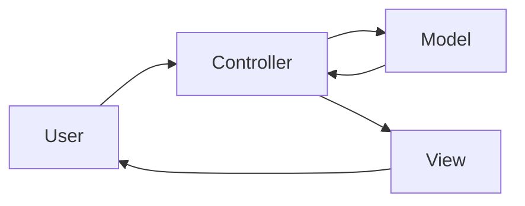
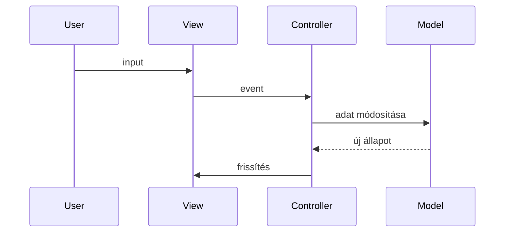

# Model-View-Controller (MVC)

A Model-View-Controller (MVC) egy klasszikus architekturális minta, amely a szoftvert három jól elkülönített részre bontja: **Model**, **View** és **Controller**. A cél az, hogy az adatkezelés, a megjelenítés és a vezérlés ne keveredjen, így a kód átláthatóbb, karbantarthatóbb és tesztelhetőbb legyen.

Az MVC elsősorban **UI-központú alkalmazásokhoz** készült, például webes, desktop vagy mobil alkalmazásokhoz.

> [!info]  
> Az MVC nem üzleti architektúra, hanem megjelenítés-orientált minta.

---

## Alapgondolat – kezdő szinten

Az MVC abból indul ki, hogy egy alkalmazásban három teljesen különböző dolog történik:

- adatokat tárolunk és módosítunk
- adatokat megjelenítünk a felhasználónak
- reagálunk a felhasználó műveleteire

Ha ezek egy helyen vannak, a kód gyorsan átláthatatlanná válik. Az MVC ezeket szétválasztja.

---

## Az MVC elemei

---

## Model

A Model felel az **adatokért és az üzleti állapotért**.

Feladatai:

- adatok tárolása
- állapot kezelése
- üzleti szabályok (korlátozott mértékben)

A Model nem tud semmit a megjelenítésről és a felhasználóról.

> [!note]  
> MVC-ben a Model gyakran túlterhelt, ezért nagy rendszereknél külön Domain rétegre bontják.

---

## View

A View felel az **adatok megjelenítéséért**.

Feladatai:

- UI kirajzolása
- adatok formázása
- felhasználói interakciók megjelenítése

A View nem tartalmaz üzleti logikát, és nem módosít adatot közvetlenül.

---

## Controller

A Controller a **közvetítő** a View és a Model között.

Feladatai:

- felhasználói input kezelése
- megfelelő Model művelet meghívása
- View kiválasztása és frissítése

A Controller irányítja az alkalmazás működését.

> [!warning]  
> Ha a Controller túl nagyra nő, az úgynevezett "God Controller" probléma jelenik meg.

---

## Tipikus MVC adatfolyam

---

## Mikor érdemes MVC-t használni?

MVC jó választás, ha:

- UI-vezérelt alkalmazást fejlesztesz
- fontos a karbantarthatóság
- szeretnéd szétválasztani a felelősségeket

Webes keretrendszerek nagy része MVC-alapú (pl. Laravel, Rails, Django).

---

## Előnyök

- tiszta felelősségi körök
- View és Model újrahasznosítható
- jól tesztelhető struktúra

---

## Hátrányok

- kezdőknek bonyolult
- könnyű túlbonyolítani
- közös logika duplikálódhat

---

## MVC és modern rendszerek

A klasszikus MVC ritkán jelenik meg tiszta formában. Gyakori variánsok:

- MVC + Service réteg
- MVC + Domain Driven Design
- MVC + Frontend framework (SPA)

---

## Összefoglalás

> [!summary]  
> Az MVC a felhasználói felület és az adatkezelés szétválasztásáról szól. Kis és közepes UI-központú alkalmazásoknál ideális, nagy rendszereknél önmagában kevés.