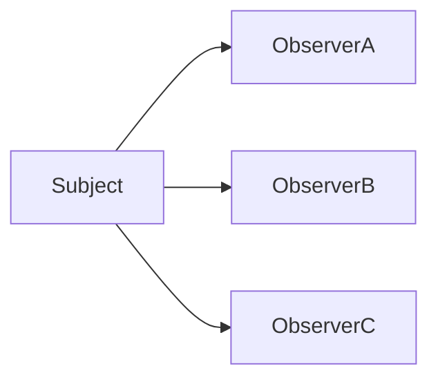

# Observer Pattern – „szólj, ha változik valami”

**Cél:**  
Lehetővé teszi, hogy egy **Subject** automatikusan értesítse a hozzá feliratkozott **Observereket**, amikor az állapota megváltozik.

> **Kulcsötlet:**  
> a Subject **nem tudja, kik figyelik**, csak szól mindenkinek.

---

## Mikor használd?

> [!info]
> 
> - Ha több objektumot kell **automatikusan értesíteni** egy állapotváltozásról.
>     
> - Ha **laza csatolású eseménykezelést** akarsz.
>     
> - Ha publish–subscribe jellegű problémád van.
>     

Tipikus példák:

- UI események
    
- domain eventek
    
- cache invalidálás
    
- realtime frissítések
    

---

## A probléma, amit megold

### ❌ Direkt értesítés

```python
user.on_save()
email.send()
logger.log()
cache.clear()
```

- a Subject túl sokat tud
    
- minden új reakció módosítást igényel
    

---

## Az Observer alapötlete

```text
Subject -> notify() -> Observerek
```

- a Subject csak **jelez**
    
- az Observerek reagálnak
    

---

## Példa – alap Observer

### Subject

```python
class Subject:
    def __init__(self):
        self._observers = []

    def attach(self, observer):
        self._observers.append(observer)

    def detach(self, observer):
        self._observers.remove(observer)

    def notify(self):
        for observer in self._observers:
            observer.update()
```

### Observer

```python
class Observer:
    def update(self):
        print("Értesítve lettem!")
```

### Használat

```python
subject = Subject()
subject.attach(Observer())
subject.notify()
```

---

## Push vs Pull modell

> [!info]  
> Két klasszikus megközelítés.

|Modell|Mit csinál?|
|---|---|
|Push|Subject adatot küld|
|Pull|Observer lekérdezi|

Példa (push):

```python
observer.update(new_state)
```

Példa (pull):

```python
observer.update()
observer.read(subject)
```

---

## Való élet példák

> [!info]
> 
> - UI event handler-ek
>     
> - Observer pattern a DOM-ban
>     
> - Domain Event rendszer
>     
> - Message broker-ek (logikai szinten)
>     

---

## Observer vs Mediator

|Observer|Mediator|
|---|---|
|Értesítés|Koordináció|
|Egy → sok|Sok ↔ sok|
|Passzív|Aktív döntéshozó|

---

## Előnyök

> [!info]
> 
> - Lazán csatolt rendszer
>     
> - Könnyen bővíthető
>     
> - Eseményvezérelt architektúra alapja
>     

---

## Hátrányok

> [!warning]
> 
> - Nehéz követni, ki mire reagál
>     
> - Rejtett mellékhatások
>     

---

## Tipikus hibák

```python
subject.attach(observer)
subject.attach(observer)
subject.attach(observer)
```

👉 duplikált feliratkozás = bug.

```python
# soha nem detach-elünk
```

👉 memória leak.

---

## Mentális modell



---

## Egy mondatos összefoglaló

> **Observer = a Subject szól, a figyelők reagálnak, egymásról nem tudnak.**