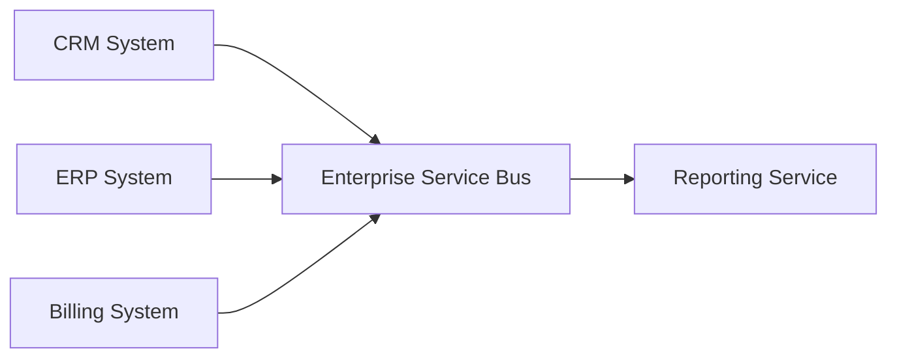
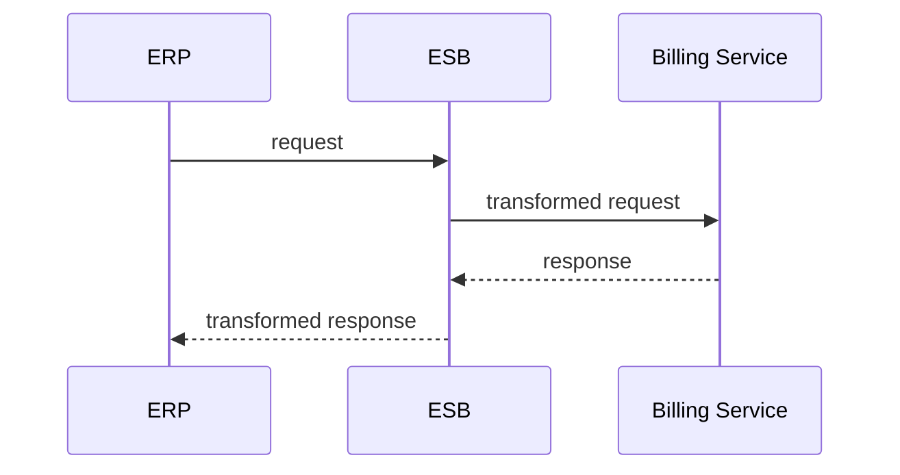

# Service-Oriented Architecture (SOA)

A Service-Oriented Architecture (SOA) egy architekturális megközelítés, ahol a rendszer **önálló szolgáltatásokra (service-ekre)** van bontva. Ezek a szolgáltatások jól definiált interfészen keresztül kommunikálnak egymással, és jellemzően **vállalati, nagy rendszerekben** jelennek meg.

A SOA célja nem az, hogy minél kisebb szolgáltatásokat hozzunk létre, hanem az, hogy **újrahasznosítható, stabil üzleti funkciókat** szolgáltatásként tegyünk elérhetővé.

> [!info]  
> A SOA elsősorban üzleti és integrációs probléma megoldására született, nem fejlesztői kényelmi mintának.

---

## Alapgondolat – teljesen kezdő szinten

A SOA abból indul ki, hogy egy nagy szervezetnél sok különböző rendszer létezik, amelyeknek **együtt kell működniük**. Ezeket nem lehet könnyen egyetlen alkalmazássá összeolvasztani, ezért inkább szolgáltatásokon keresztül kapcsolódnak össze.

Egy SOA-alapú rendszerben:

- a szolgáltatások üzleti funkciókat valósítanak meg
- a kommunikáció szabványos protokollokon történik
- a hangsúly az integráción és az újrahasznosításon van

---

## Magas szintű felépítés

> [!note]  
> A SOA egyik kulcseleme gyakran egy központi közvetítő (ESB).

---

## Mit jelent egy service SOA-ban?

Egy SOA service:

- egy üzleti funkciót valósít meg
- stabil, ritkán változó interfésszel rendelkezik
- több rendszer által is használható

Példák:

- Customer Management Service
- Billing Service
- Authentication Service

Ezek a service-ek jellemzően **nem kicsik**, és nem egyetlen csapat igényeire vannak szabva.

---

## Kommunikáció és integráció

A SOA rendszerekben a kommunikáció gyakran:

- SOAP
- XML-alapú üzenetek
- HTTP vagy message queue

A központi réteg gyakran adat- és protokoll-transzformációt is végez.

---

## Mikor érdemes SOA-t használni?

SOA akkor jó választás, ha:

- nagyvállalati környezetben dolgozol
- sok heterogén rendszer van
- hosszú élettartamú, stabil üzleti funkciókat kell integrálni
- fontos a rendszerfüggetlen újrahasznosítás

---

## Előnyök

- jó integrációs képesség
- üzleti funkciók újrahasznosíthatók
- technológiafüggetlen kommunikáció

---

## Hátrányok

- központi ESB bottleneck lehet
- lassú fejlesztési ciklus
- nagy komplexitás
- nehéz skálázni finom granularitással

> [!warning]  
> A SOA gyakran túl nehézkes modern, gyorsan változó rendszerekhez.

---

## SOA vs Microservices

SOA:

- nagyobb szolgáltatások
- központi integráció (ESB)
- üzleti fókusz

Microservices:

- kicsi szolgáltatások
- decentralizált kommunikáció
- fejlesztői és deploy fókusz

---

## Összefoglalás

> [!summary]  
> A Service-Oriented Architecture egy integráció-orientált minta, amely nagyvállalati rendszerek összekötésére kiváló, de modern alkalmazásokhoz gyakran túl nehézkes.