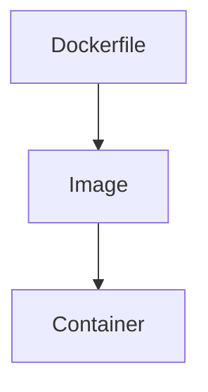
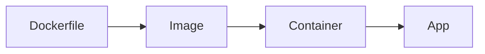
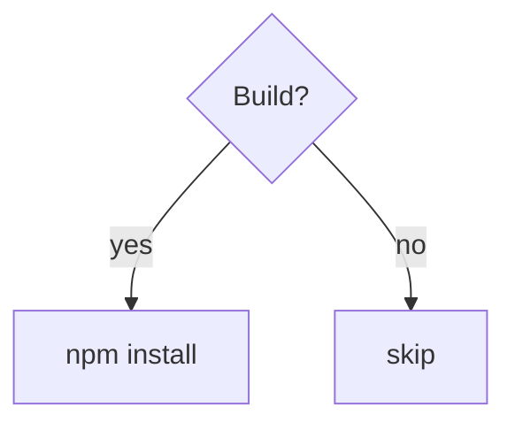
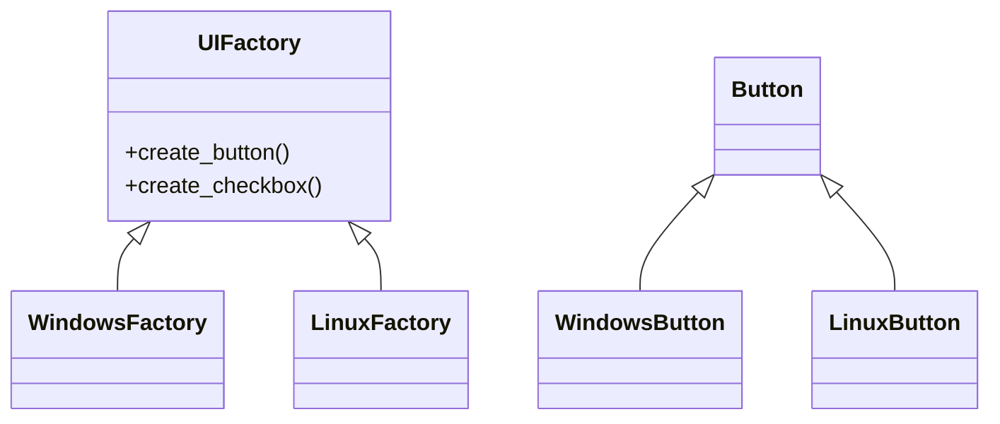
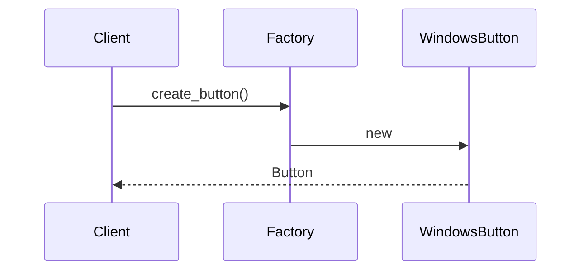
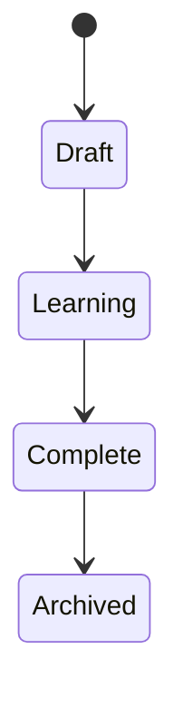
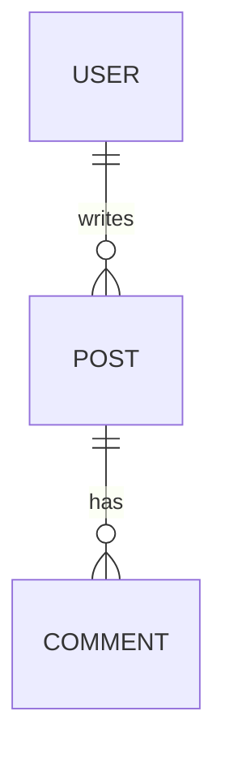
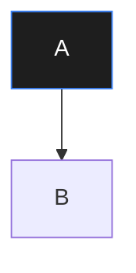

## Mit jelent?
- `graph TD` → Top → Down irány
- `[]` → doboz
- `-->` → nyíl

👉 **folyamatok, architektúra, build flow**

---

## Irányok
```text
TD = top-down
LR = left-right
RL = right-left
BT = bottom-top
```

---

### Fentről le:
```text
graph TD
A[Dockerfile] --> B[Image]
B --> C[Container]
```



---

### Jobbról balra: 
```text
graph LR
Dockerfile --> Image
Image --> Container
Container --> App
```



---

### Elágazások:
```text
graph TD
A{Build?}
A -->|yes| B[npm install]
A -->|no| C[skip]
```



---

### Class diagram (OOP-hoz 🔥)
```text
classDiagram
UIFactory <|-- WindowsFactory
UIFactory <|-- LinuxFactory

UIFactory : +create_button()
UIFactory : +create_checkbox()

Button <|-- WindowsButton
Button <|-- LinuxButton
```



---

### Sequence diagram (folyamatidő)
```text
sequenceDiagram
Client->>Factory: create_button()
Factory->>WindowsButton: new
WindowsButton-->>Client: Button
```


---

### State diagram (állapotgép)
```text
stateDiagram-v2
[*] --> Draft
Draft --> Learning
Learning --> Complete
Complete --> Archived
```




---

### ER diagram (adatbázishoz)
```text
erDiagram
USER ||--o{ POST : writes
POST ||--o{ COMMENT : has
```



---

### Styling (csak óvatosan)
```text
graph TD
A --> B
style A fill:#1e1e1e,stroke:#3b82f6,color:#fff
```



